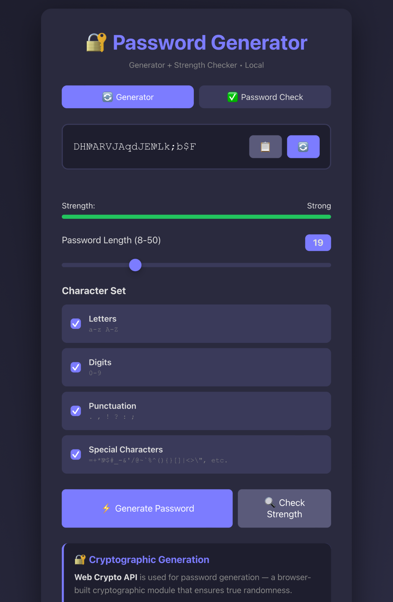

# Password Generator en

A cryptographic password generator featuring strength verification. All operations are executed locally on your device, ensuring that no data is transmitted to external servers.


Cryptographic password generator with strength checking. All operations are performed locally on your device — no data is transmitted to servers.

## 🖼️ Appearance



*Dark theme, responsive design, strength indicator*

## ✨ Features

- 🔐 **Cryptographic Generation** — uses Web Crypto API (CSPRNG)
- 🏠 **Complete Locality** — all operations on your device, no internet required
- 📊 **Strength Check** — analyze any password (4-150 characters)
- ⏱️ **Crack Time** — calculate resistance to brute force attacks
- 🎨 **Modern Interface** — dark theme, responsive design
- 📋 **One Click** — copy password to clipboard
- 🔢 **Password Length** — from 8 to 50 characters
- 🔠 **4 Character Sets** — letters, digits, punctuation, special characters

## 🚀 Demo

Simply open the `index.html` file in any modern browser. No servers, builds, or dependencies required!

## 📥 Installation and Usage

### Local Usage

1. Download the `index.html` file
2. Open it in a browser (Chrome, Firefox, Safari, Edge)
3. Generate passwords and check their strength

### Running from Repository

```bash
git clone https://github.com/YOUR_USERNAME/password-generator-en.git
cd password-generator-en
# Open index.html in browser
# Or use live-server for convenience:
npx live-server
```

### Web Deployment

You can host it on GitHub Pages, Netlify, Vercel, or any other static file hosting service.

## 🛡️ Security

- ✅ **Web Crypto API** — cryptographically secure random number generator
- ✅ **Local Entropy** — randomness collection from mouse movements and keystrokes
- ✅ **No Telemetry** — no requests to servers
- ✅ **No Logging** — passwords are not saved anywhere

## 📊 Strength Calculation

Entropy is calculated using the formula:

**E = L × log₂(N)**

Where:
- **L** — password length
- **N** — number of unique characters in the password

### Strength Assessment Table

| Entropy (bits) | Rating | Example Password |
|----------------|--------|------------------|
| < 28 | Very Weak | qwerty |
| 28-36 | Weak | pass123 |
| 36-50 | Medium | MyDogRex2020 |
| 50-65 | Good | k7#2mP!9qR |
| 65-80 | Strong | X#mP9$kL2@nQ4 |
| ≥ 80 | Very Strong | T#8kLp$2mN@9qR&5vX |

## 🖥️ Browsers

Supported by all modern browsers with Web Crypto API:
- Chrome/Edge 80+
- Firefox 75+
- Safari 13+
- Opera 67+

## 📁 Project Structure

```
password-generator-en/
├── index.html          # Single file (HTML, CSS, JS)
├── screenshot.png      # Application screenshot
└── README.md          # Documentation
```

## 💝 Financial Support

💳 Details for financial support:

Support development if the project saved you time or improved your security!

**🔹 USDT (Polygon) — Recommended (low fee)**  
`0x0100CAB59D16b9f5C68f88132F27b295c84560Fe`

**🔹 USDT (Arbitrum)**  
`0x0100CAB59D16b9f5C68f88132F27b295c84560Fe`

**🔹 USDT (Ethereum / ERC-20) — High fee!**  
`0x0100CAB59D16b9f5C68f88132F27b295c84560Fe`

**🔹 BTC**  
`bc1qfdtjg8ls3lva9tx7vrzxy3m8mlpvdlvp2am8lk`

**🔹 Ethereum (ETH)**  
`0x02f2c8075ba6a8EFDffdBAcF6E958bC905017C74`

**🔹 Monero (XMR)**  
`Fx1VEfgZqqqbFV3TfYwrrjrmXuoSkwaWJQAcAr341hr5`

**🔹 Ethereum Classic (ETC)**  
`0xf66Fc76daA8D9da7438e560F28B838c7aFdBCE36`

⚠️ **Warning:** Before sending, make sure you have selected the correct network/currency. Errors in network/currency lead to irreversible loss of funds.

**Free support:**  
⭐⭐⭐ Just give a star — it's already a big help!

## 🤝 Contributing

Pull requests are welcome! For major changes, please open an issue first.

1. Fork the repository
2. Create your feature branch (`git checkout -b feature/AmazingFeature`)
3. Commit your changes (`git commit -m 'Add AmazingFeature'`)
4. Push to the branch (`git push origin feature/AmazingFeature`)
5. Open a Pull Request

## 📝 TODO

- [ ] Add option to "exclude similar characters" (i, l, 1, O, 0)
- [ ] Export/import settings to JSON
- [ ] PWA for installation on device
- [ ] Support for passphrase generation
- [ ] i18n (English, Russian)

## 📄 License

Distributed under the MIT License. See `LICENSE` for more information.

## 🙏 Acknowledgments

- **MDN Web Docs** — for excellent documentation on Web Crypto API
- **Entropy Bits Calculator** — for the entropy calculation formula

## 📧 Contact

**👤 Author:** JDHKod  
**GitHub:** [github.com/JDHKoD](https://github.com/JDHKoD)

For questions and suggestions — create an [Issue](https://github.com/JDHKoD/password-generator-en/issues)

⭐ **Star the project if you find it useful!**

🔒 **Your security is our main goal. Everything works locally, no servers, no tracking.**
